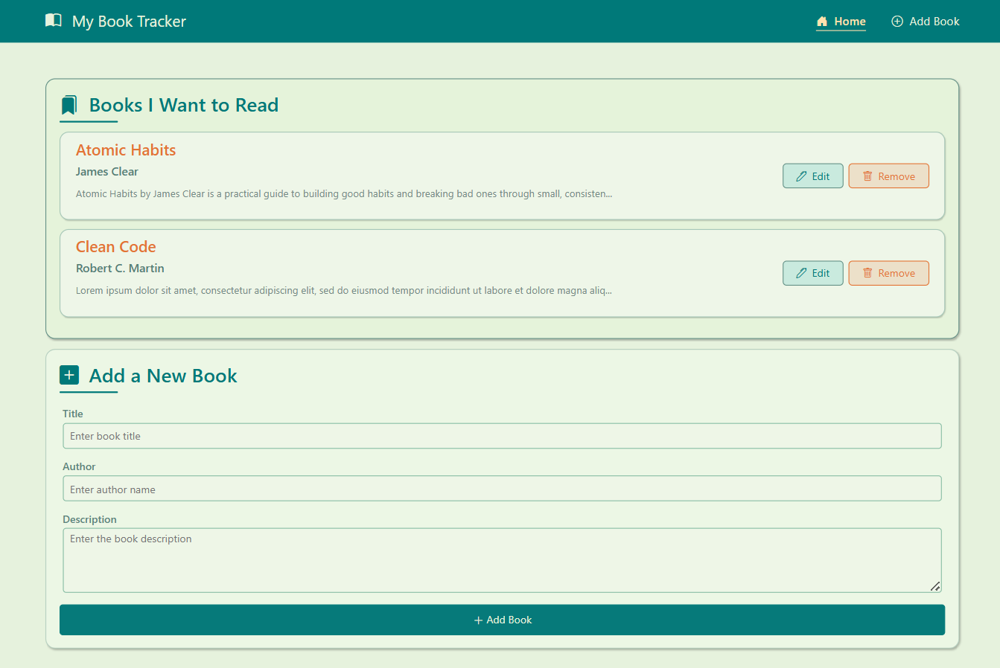
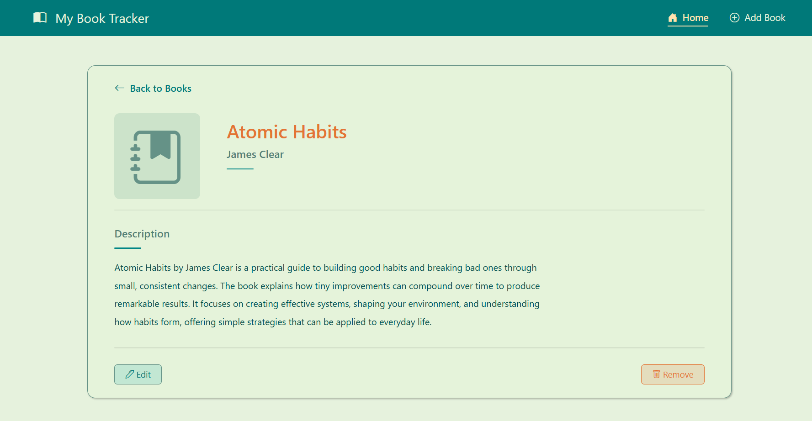
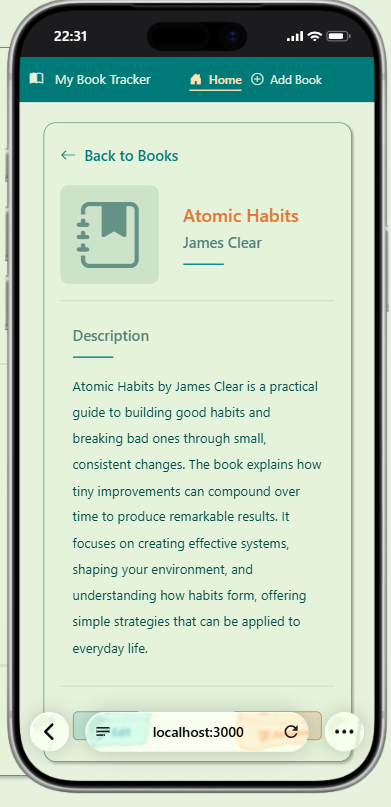

# 📚 Book Tracker

Book Tracker is a simple web application for managing a personal list of books you want to read.

The application allows users to add books, view their details, edit existing book information, and remove books from the collection.

This project was built as a practice project to strengthen my understanding of backend web development using Node.js, Express.js, and EJS.

## ✨ Features

- View all books in the collection
- Add a new book
- View detailed information about a specific book
- Edit existing book information
- Remove books from the collection
- Responsive design for desktop and mobile devices

Each book contains:

- Title
- Author
- Description

## 🛠️ Technologies Used

- Node.js
- Express.js
- EJS
- HTML5
- CSS3
- Bootstrap 5
- Bootstrap Icons

## 📂 Project Structure

```text
Book-Tracker/
│
├── public/
│   └── styles.css
│
├── views/
│   ├── partials/
│   │   ├── header.ejs
│   │   └── footer.ejs
│   │
│   ├── book.ejs
│   ├── edit.ejs
│   └── index.ejs
│
├── .gitignore
├── index.js
├── package.json
├── package-lock.json
└── README.md
```

## 🚀 Getting Started

Follow these steps to run the project locally.

### 1. Clone the repository

```bash
git clone https://github.com/Illy-2024/book-tracker.git
```

### 2. Navigate to the project directory

```bash
cd book-tracker
```

### 3. Install the dependencies

```bash
npm install
```

### 4. Start the application in development mode

```bash
npm run dev
```

The application uses Nodemon during development, so the server will automatically restart when changes are detected.

### Production

To start the application without Nodemon:

```bash
npm start
```

### 5. Open the application

Open your browser and visit:

```text
http://localhost:3000
```

## 💡 How It Works

The application uses Express.js to handle HTTP requests and routing.

EJS is used as the templating engine to dynamically render book information received from the Express server.

The application currently stores book data in memory while the server is running. This means that newly added or edited books will be reset when the server restarts.

## 📸 Screenshots

### Home Page



### Book Details



### Mobile View



## 🌐 Live Demo

A live version of the application will be available here after deployment.

## 🎯 Project Purpose

The purpose of this project is to practice and understand:

- Express.js routing
- Handling GET and POST requests
- Working with route parameters
- Processing form data
- Using EJS templates
- Passing data from Express to EJS
- Creating reusable EJS partials
- Implementing CRUD-like operations
- Building responsive user interfaces
- Structuring a simple Express.js application

## 🔮 Future Improvements

Possible improvements for the project include:

- Add a database for persistent book storage
- Add form validation and user feedback
- Add book cover images
- Add reading status such as "Want to Read", "Reading", and "Completed"
- Add search and filtering
- Add user authentication
